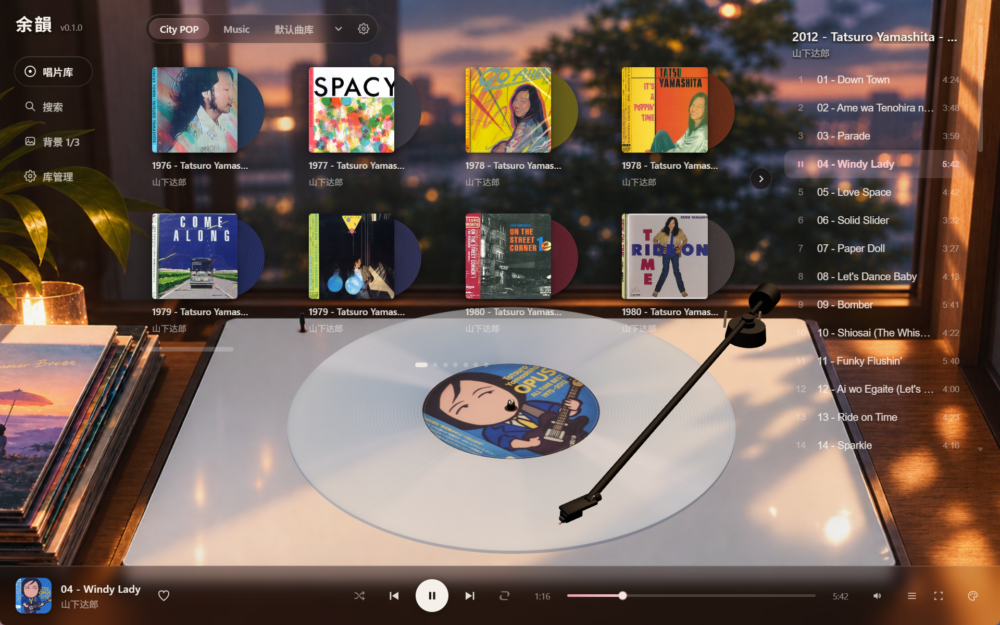
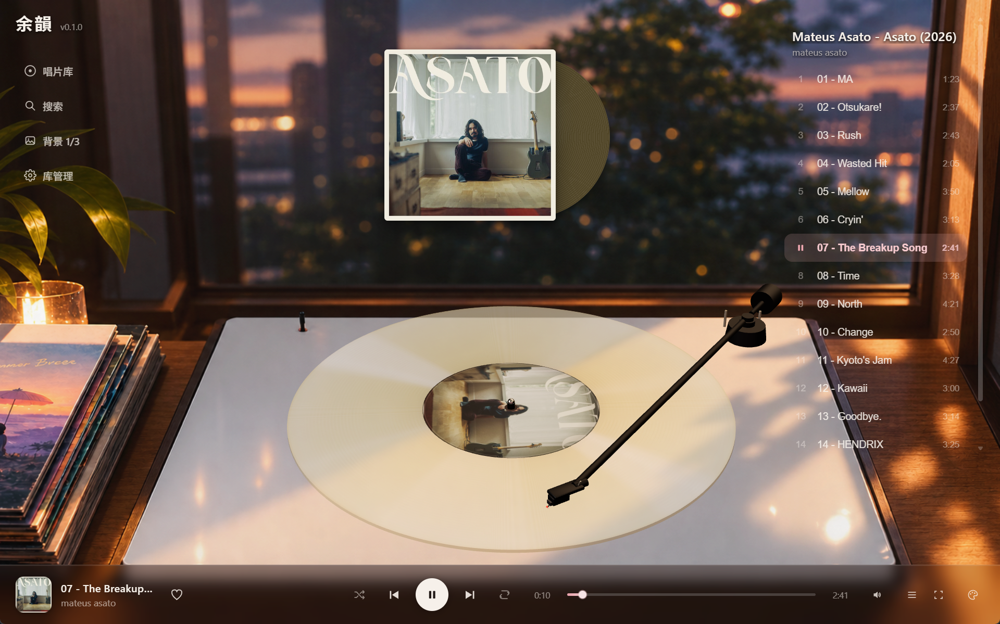

# 余韻 Yoin

把你的硬盘,变成一间有唱机的房间。

余韻是一款为黑胶爱好者打造的本地专辑播放器。它不管理"歌曲",它陈列**唱片**——每一张专辑都是一张完整的唱片:有封套、有盘面、有从外圈导入槽走到内圈收尾槽的完整一面。



---

## 一间属于唱片的房间

打开余韻,你会先看到一间暖色调的房间:唱机、灯光、还有正在旋转的那张唱片。

**唱臂真的在循迹。** 播放一首歌,唱臂沿着盘面的螺旋沟槽缓缓内移——整张专辑走到哪里,唱针就落在哪里。快进到最后一轨,唱臂已经靠近盘芯;回到第一轨,它重新回到导入槽。这不是进度条,这是唱针的位置。

**唱片会转。** 33⅓ 转,和你的机器一样。暂停时它停下,播放时它继续。

**盘面的颜色属于这张唱片。** 默认是玫瑰石英色;也可以让唱片跟随封面取色,手动挑一个色相,或者让它随音乐的起伏泛起色泽。唱片的质感——沟槽的银色纹路、PVC 的半透明边缘、盘芯的纸质标签——都照着真实黑胶去做。

## 唱片架,不是文件列表

曲库以封套的形式陈列在架上,黑胶从封套侧面探出一角,和你在唱片店看到的一样。鼠标掠过时,封套轻轻浮起,唱片滑出一截。



- **整架浏览**:每页八张,滚轮翻页
- **收起唱片架**时,正在播放的唱片以两倍尺寸悬在房间上方——可以拖拽它,它会带着阻尼微微倾侧,像你捏着一张唱片端详
- 支持多曲库:把不同来源的音乐放进不同的"柜子",随时切换

## 关于听音的方式

- **按专辑听**,从头到尾,像翻一面唱片
- 支持 **CUE 整轨专辑**:一张 CD 抓成的单个文件 + CUE,自动拆出曲目与时长
- 支持**随机**与**循环**(列表循环 / 单曲循环)
- 右侧曲目单如同一张唱片背面,正在播放的曲目高亮显示

## 收进你的唱片

音乐保持它本来的样子——文件夹即唱片:

```
你的音乐根目录/
├── 艺术家/
│   └── 专辑/            ← 一张唱片
│       ├── cover.jpg     ← 封面(有则显示)
│       ├── *.flac / wav / mp3 …
│       └── *.cue         ← 可选,CUE 整轨拆分
```

指定一个根目录,余韻会扫出所有唱片。不放封面也没关系——封套上会印上专辑的名字。

---

*余韻:乐曲终止后,仍在空间里回荡的那部分。*

---

<details>
<summary>开发者信息</summary>

```bash
pnpm install
pnpm tauri dev
```

技术栈:Tauri 2 · React · Zustand · Three.js / React Three Fiber

</details>
